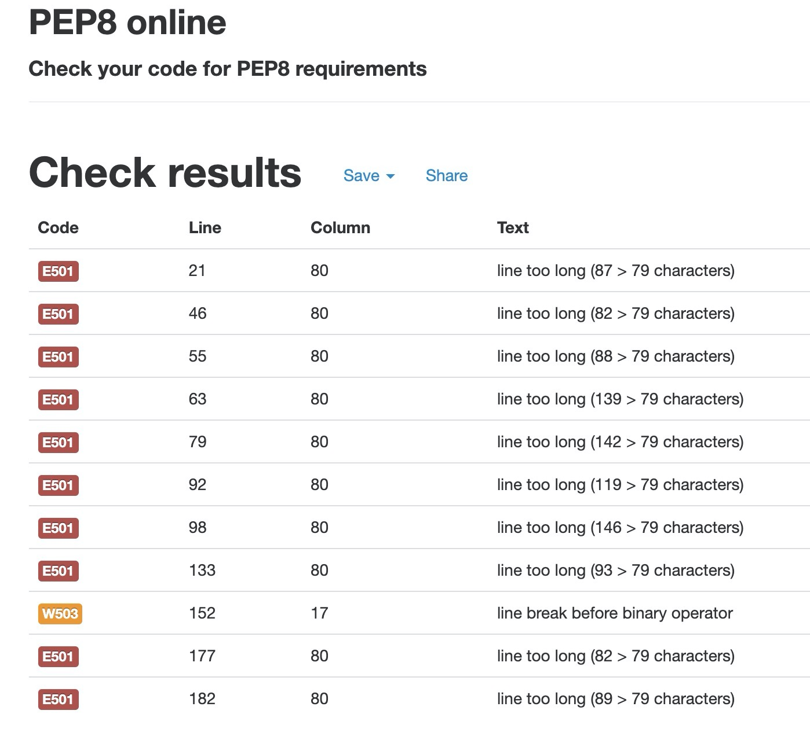

# Battleshipasaurus

Battleshipasaurus is a Battleship game created using **Python**, and runs on a mock terminal on Heroku.

:point_right: [Live Project](https://battleshipasaurus.herokuapp.com/)

## Instructions

The aim of the game is to sink the enemies battleships:

- If they correctly guess all the ships on the board they win

- If they don't hit all the ships within the number of turn they lose the game

## Technologies

[Python](https://www.python.org) - main game language and it's default modules
[VS Code](https://code.visualstudio.com/) - To set up Python environment and text editor
[Heroku] for site deployment and to store created files

## Features

- One player game

- Instructions of the game

- User feedback for errors

- Grid elements so that user can distinguish between empty spaces, ships and misses

- Game Over prompt, Restart Game prompt to allow user to control start of game within the console.

- Number of turns are displayed to the user

- Number of ships left are displayed to the user

### Future Features

- User to play against the computer

- Custom grid size

- Increased game difficulty

- Option to add different types of ships like the Carrier, Cruiser, Submarine etc.

## Data Model

Game is made using python functions

## Testing

### Bugs

#### Solved bugs

- Fix bug where value entered in terminal did not match the board index.

- Fix bug where console with give valueError when game is run for the first time

- Fix bug where game over prompt was not being triggered at the end of game loop

#### Unfixed bugs

- Game start prompt will not start the game loop if too many gaps are typed in the console.

#### Validator testing

- PEP8

</img>

## Deployment

Game was deployed using [Heroku](https://www.heroku.com/)

- In your vscode or gitpod terminal inside your current workspace:
  type in:
  - `touch requirements.txt`
  - `pip3 freeze > requirements.txt`

This is to add dependencies to your deployed project

- To deploy this project you need a Heroku account

- Once logged in, click the CREATE NEW APP button

- Add a unique name for your project in lowercase and spaces separated by '-' the create new app

- Click on the settings page and add the Python THEN the Node.js build packs

- Go to the Deploy tab

- Connect your GitHub account and select the 'main' brach of your project

- Near the bottom on the page, you have two options on how to deploy your project. You can either do:

  - Automatic Deployment which will deploy your project after every change to your main github repository
  - Manual Deployment where the user has to prompt for the deployment.

- Which ever option you decide you have to do an initial Manual deployment to Heroku for the first upload.

- The app will install the necessary files and dependencies. Finally, a message was displayed: 'Your app was successfully deployed.'

## Acknowledgements

- [Codeacademy Python 2: Lists and Functions](https://www.codecademy.com/courses/learn-python/lessons/battleship) Template that helped me build the game logic
- [ASCII table](http://sticksandstones.kstrom.com/appen.html)
- [Alphabet string](https://www.kite.com/python/answers/how-to-make-a-list-of-the-alphabet-in-python)
